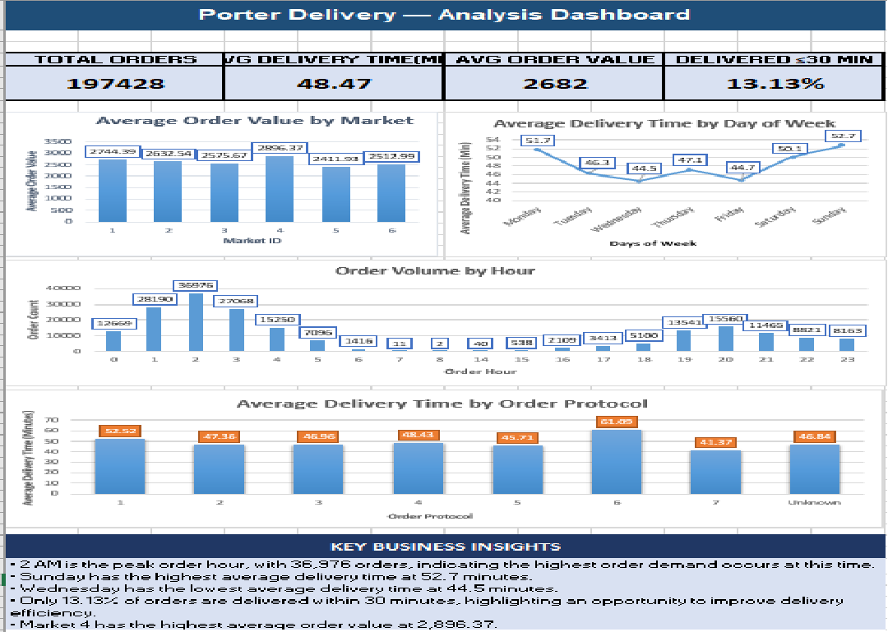

# Porter Delivery Analysis

## Project Overview

This project analyzes food delivery order data to understand factors
influencing delivery time, order value, market performance, partner
availability, and store category performance.

The analysis was performed using Microsoft Excel with data cleaning,
calculated columns, PivotTables, statistical analysis, correlation,
regression analysis, and dashboard visualization.

## Business Objective

The objective is to identify operational trends and factors affecting
delivery performance and order value, and provide actionable insights
that can help improve delivery efficiency and customer satisfaction.

## Tools Used

- Microsoft Excel
- PivotTables
- PivotCharts
- Data Cleaning
- Correlation Analysis
- Regression Analysis
- Data Visualization

## Analysis Performed

### Basic Analysis

- Order volume by market
- Average delivery time by store category
- Peak order hours
- Order volume by day of week
- Correlation between total items and subtotal
- Delivery-time outlier analysis
- Percentage of orders delivered within 30 minutes
- Relationship between order volume and busy partners
- Average delivery time by day
- Stores with longest average delivery times

### Medium-Level Analysis

- Delivery performance by order protocol
- Average order value by market
- Relationship between on-shift partners and delivery time
- Impact of total and distinct items on delivery time
- Delivery-time trends throughout the week
- Impact of item price range on order value
- Above-average orders by store category
- Delivery-time variability by market and category
- Busy/on-shift partner availability analysis

## Key Findings

- Total orders analyzed: 197,428
- Overall average delivery time: 48.47 minutes
- Average order value: approximately 2,682.37
- 13.13% of orders were delivered within 30 minutes
- 2 AM was the peak order hour with 36,976 orders
- Sunday had the highest average delivery time at approximately 52.7 minutes
- Wednesday had the lowest average delivery time at approximately 44.5 minutes
- Market 4 had the highest average order value at approximately 2,896.37
- Item price range and subtotal showed a correlation of approximately 0.51

## Dashboard

## Project Files

- `Porter_Delivery_Analysis.xlsx` - Complete Excel analysis and dashboard
- `dashboard.png` - Dashboard preview

## Business Recommendations

- Improve delivery partner availability during high-demand periods.
- Monitor markets with high delivery-time variability.
- Focus operational improvements on weekend delivery performance.
- Use order-value and category insights to support promotional strategies.
- Optimize partner scheduling based on demand and partner utilization.
